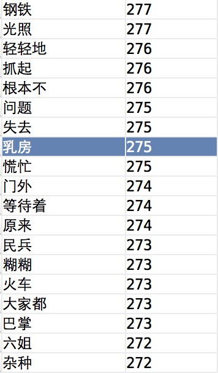

# spark_statistics

spark处理大规模语料库统计词频。


## 分词原理

wordmaker提供了一个统计大规模语料库词汇的算法，和结巴分词的原理不同，它不依赖已经统计好的词库或者隐马尔可夫模型，但是同样能得到不错的统计结果。原作者的文档提到是用多个线程独立计算各个文本块的词的信息，再按词的顺序分段合并，再计算各个段的字可能组成词的概率、左右熵，得到词语输出。下面就详细的讲解各个步骤：


## 代码解释

原始的C++代码挺长，但是用python改写之后很少，上文中的123步用spark实现非常简单，代码在split函数中，如下：

```
python
def split(self):
    """spark处理"""
    raw_rdd = self.sc.textFile(self.corpus_path)

    utf_rdd = raw_rdd.map(lambda line: str_decode(line))
    hanzi_rdd = utf_rdd.flatMap(lambda line: extract_hanzi(line))

    raw_phrase_rdd = hanzi_rdd.flatMap(lambda sentence: cut_sentence(sentence))

    phrase_rdd = raw_phrase_rdd.reduceByKey(lambda x, y: x + y)
    phrase_dict_map = dict(phrase_rdd.collect())
    total_count = 0
    for _, freq in phrase_dict_map.iteritems():
        total_count += freq

    def _filter(pair):
        phrase, frequency = pair
        max_ff = 0
        for i in xrange(1, len(phrase)):
            left = phrase[:i]
            right = phrase[i:]
            left_f = phrase_dict_map.get(left, 0)
            right_f = phrase_dict_map.get(right, 0)
            max_ff = max(left_f * right_f, max_ff)
        return total_count * frequency / max_ff > 100.0

    target_phrase_rdd = phrase_rdd.filter(lambda x: len(x[0]) >= 2 and x[1] >= 3)
    result_phrase_rdd = target_phrase_rdd.filter(lambda x: _filter(x))
    self.result_phrase_set = set(result_phrase_rdd.keys().collect())
    self.phrase_dict_map = {key: PhraseInfo(val) for key, val in phrase_dict_map.iteritems()}
```
第三部过滤后的结果已经相对较小，可以直接取出放入内存中，再计算熵过滤，在split中执行```target_phrase_rdd.filter(lambda x: _filter(x))```过滤的时候可以phrase_dict_map做成spark中的广播变量，提升分布式计算的效率，因为只有一台机器，所以就没有这样做。

## 分词结果

进入spark_statistics/splitter目录，执行命令```PYTHONPATH=. spark-submit spark.py```处理test/moyan.txt文本，只是莫言全集，统计完成的结果在out.txt中，统计部分的结果如下：



(我也不知道为什么这个词这么多)

## 问题汇总

1. 上述的算法不能去掉连词，结果中会出现很多类似于轻轻地 等待着这种词
2. 单机上用spark处理小规模数据没有任何优势，比wordmaker中的C++代码慢很多
